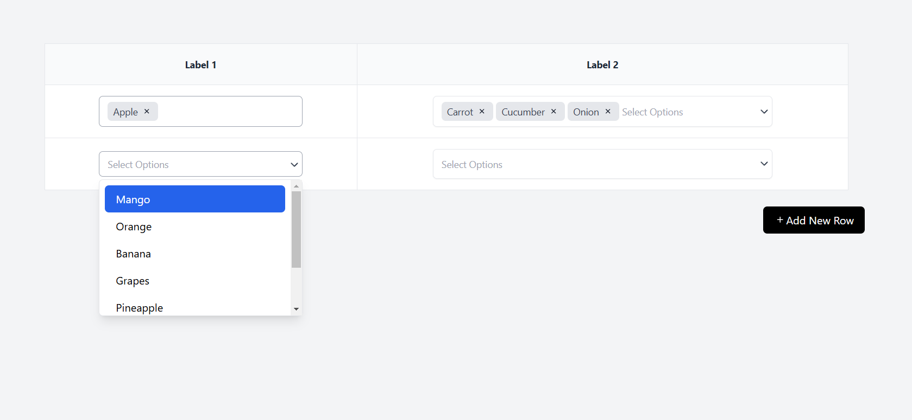

# Cloudify Assignment

## Overview

This project leverages the following cutting-edge technologies:

- **Vite**: A lightning-fast development server and optimized build process.
- **React**: For building the dynamic user interface.
- **Tailwind CSS**: A utility-first CSS framework for rapid UI development.
- **React Icons**: For seamlessly integrating icons into the application.

---

## Installation

Follow these steps to set up the project locally:

1. **Clone the repository:**
   ```bash
   git clone https://github.com/basaiteja/Cloudify-Assignment.git
   ```

2. **Navigate to the project directory:**
   ```bash
   cd <project_directory>
   ```

3. **Install dependencies:**
   ```bash
   npm install
   ```

---

## Available Scripts

### `npm run dev`
- Starts the Vite development server.
- Open [http://localhost:5173](http://localhost:5173) to view the app in your browser.
- Supports **Hot Module Replacement (HMR)** for live updates without page refresh.

### `npm run build`
- Builds the app for production.
- The output is placed in the `dist` folder.
- Features:
  - Bundles React for production.
  - Optimizes the build for top-notch performance.
  - Minifies code and includes hashed filenames.

### `npm run preview`
- Previews the production build locally after running the `build` script.

### `npm start`
- Alias for `npm run dev` for familiarity with React's default setup.

---

## Installing React Icons

Icons are implemented using the **React-Icons** library. To install:

```bash
npm install react-icons --save
```

You can browse the available icons in the [React-Icons library](https://react-icons.github.io/react-icons/).

---

## Features

- **Vite Development Server**: Fast reloads and optimized development workflow.
- **React Components**: Modular structure for easy management and scalability.
- **Tailwind CSS Integration**: Simplified and rapid UI design process.
- **Dynamic Icons**: Incorporates Feather and Heroicons via React-Icons.

---

## Screenshots



---

## Folder Structure

The project is organized as follows:

```
Cloudify Assignment
├── node_modules
├── public
├── src
│   ├── Components
│   │   ├── Label1.jsx
│   │   ├── Label2.jsx
│   │   └── Table.jsx
│   ├── App.css
│   ├── App.jsx
│   ├── index.css
│   ├── main.jsx
├── .gitignore
├── eslint.config.js
├── image.png
├── index.html
├── package-lock.json
├── package.json
├── postcss.config.js
├── README.md
├── tailwind.config.js
└── vite.config.js
```

---


